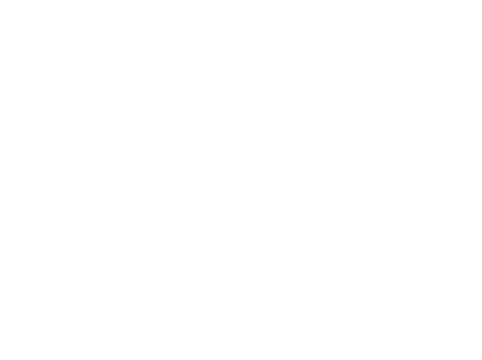

<h1 align="center">Hi there, I'm Riccardo!👋🤠</h1>

    

👨‍💻 Visit my portfolio →
    <a href="https://portfolio-rmdevv.vercel.app/" target="_blank" rel="noreferrer">
        <b>portfolio-rmdevv</b>
    </a>

💼 LinkedIn →
    <a href="https://www.linkedin.com/in/riccardo-michelon/" target="_blank" rel="noreferrer">
        <b>riccardo-michelon</b>
    </a>

🚩 Passionate about <b>3D Development</b> and <b>Computer Vision</b>

🌱 Currently learning <b>Three.js</b> and <b>OpenCV</b>

📬 Feel free to contact me →
    <a href="mailto:rm.swdev@gmail.com" target="_blank" rel="noreferrer">
        <b>rm.swdev@gmail.com</b>
    </a>

<h3 align="center">Languages and Tools</h3>

    
    
    
    
    
    
    
    
    
    
    
    

